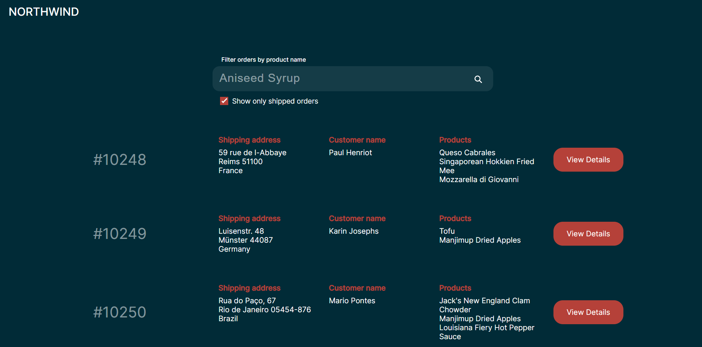
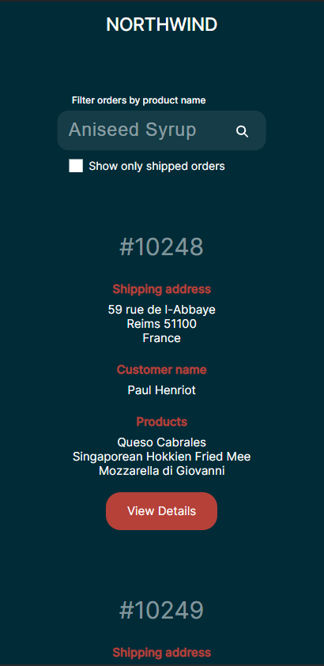

# Northwind Dashboard

[](https://github.com/elessartech/northwind-dashboard/actions/workflows/pipeline.yml)

## Deployment

### Frontend

[https://northwind-frontend.onrender.com](https://northwind-frontend.onrender.com/)

### Backend

[https://nortwind-backend.onrender.com](https://nortwind-backend.onrender.com/)


## Admin credentials

One can log in the application using the following credentials:

- Email: admin@test.com
- Password: test

## Tech stack

The app is written using the following technologies:

- [React.js](https://react.dev/)
- [Typescript](https://www.typescriptlang.org/)
- [Node.js](https://nodejs.org/en)
- [Express.js](https://expressjs.com/)
- [sqlite3](https://www.npmjs.com/package/sqlite3) 
- [Northwind database](https://github.com/jpwhite3/northwind-SQLite3)
- [esLint](https://eslint.org/)
- [Docker](https://www.docker.com/)/[docker-compose](https://docs.docker.com/compose/)
- [Yarn](https://yarnpkg.com/)
- [Jest](https://jestjs.io/)
- [Vitest](https://vitest.dev/)

## Backend commands

The following commands are to be executed from the root directory of the backend part of the app.

### Install required packages
```bash
yarn
```

### Run development server
```bash
yarn run dev
```

### Run production server
```bash
yarn start
```

### Tests
```bash
yarn run test
```

### Lint
```bash
yarn run lint
```

### Build
```bash
yarn run build
```

### Prettier
```bash
yarn run prettier
```

## Frontend commands

The following commands are to be executed from the root directory of the frontend part of the app.

### Install required packages
```bash
yarn
```

### Run development server
```bash
yarn start
```

### Build
```bash
yarn run build
```

### Tests
```bash
yarn run test
```

### Lint
```bash
yarn run lint
```

### Prettier
```bash
yarn run prettier
```

### Eject

```bash
yarn run eject
```

## Docker commands

The following commands are to be executed from the root directory of the app.

### Bring up services

```bash
docker-compose up -d
```

### Bring up and build services

```bash
docker-compose up -d --build
```

### Shut down services

```bash
docker-compose down
```

## Environment variables

Environment variables can be defined in `.env`-files in both `backend` and `frontend` directories.

### Backend

| Key | Value |
| ------ | ------ |
| DATABASE_URL  | {PATH_TO_SQL_DB} |
| PORT  | {PORT} |
| CONNECTION_URL  | {PATH_TO_MONGO_DB} |
| ADMIN_NAME  | {NAME_OF_ADMIN_USER} |
| ADMIN_EMAIL  | {EMAIL_OF_ADMIN_USER} |
| ADMIN_PASSWORD  | {PASSWORD_OF_ADMIN_USER} |

### Frontend

| Key | Value |
| ------ | ------ |
| REACT_APP_BACKEND_URL  | http://{HOST}:{PORT}/api |

## Launch

- Install required packages using corresponding commands for [frontend](https://github.com/elessartech/kesko-assignment#install-required-packages-1) and [backend](https://github.com/elessartech/kesko-assignment#install-required-packages).
- Create `.env`-files with corresponding variables defined from the table above in the root of `frontend` and `backend` directories. 
- Run backend via command `yarn start` in one terminal window.
- Run frontend via command `yarn start` in another terminal window.
- Head over to http://localhost:3000/ in your browser.

## Interface

### Desktop



### Mobile



## Functionality

- ✅ The application has a good-looking UI with a responsive layout.
- ✅ The backend provides RESTful API.
- ✅ The code is set to be maintainable, testable and scalable.
- ✅ There is documentation on how to run the code and the test.
- ✅ The application works on mobile as well.
- ✅ An administrator user is capable to login to the application via the interface. Unsuccessful login attempts are handled correctly.
- ✅ It is possible to view all orders.
- ✅ Typing in the input will cause the orders to filter as user types. Filtering is done by the product name in the order.
- ✅ When the checkbox is checked then only shipped orders are shown.
- ✅ All products are shown if 4 or fewer. Otherwise, only 3 products are shown and the text indicating there are more orders as shown in the design.
- ✅ The “View details” button is a link to the URL “order/{orderIdHere}”.
- ✅ On the “order/{orderIdHere}” page a user may see individual orders by id and download the CSV of them.
- ✅ Statistics page contains several charts (including Pie and Calendar) that display information on order statistics. 
- ✅ The application is deployed to a cloud hosting service.


## Known issues

- When trying to bring up the backend service via Docker it throws the following error:

```
Error: Cannot find module '/usr/src/app/node_modules/sqlite3/lib/binding/napi-v6-linux-glibc-x64/node_sqlite3.node'
```
The reinstallation of `sqlite3` package did not help. I believe it relates to [this issue](https://github.com/TryGhost/node-sqlite3/issues/1513).


## Potential improvements

- Solve the issue with sqlite3 package installation in Docker and run the app properly within the Docker environment.
- Introduce end-to-end tests (e.g. with cypress) to the frontend part of the app.
- Add order data pagination and filtering(e.g. by order date).
- Write more unit tests for the frontend.
